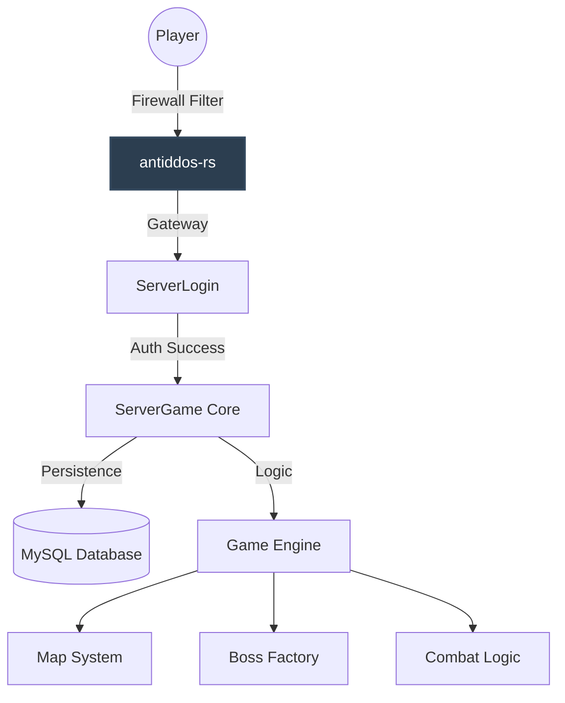

<div align="center">
  

  # Zeion NRO: The Ultimate Dragon Ball Core

  [](https://adoptium.net/)
  [](https://maven.apache.org/)
  [](#)
  [](#)

  **A state-of-the-art, high-performance Ngọc Rồng Online server infrastructure.**
  *Optimized for extreme concurrency, modern security standards, and professional developer experience.*

  ---
</div>

## Vision
**Zeion NRO** is not just another private server source. It is a complete modernization of the legendary NRO backend. By leveraging **Java 21 LTS** and a refined **Thread-Safe Architecture**, we provide a rock-solid foundation for the next generation of Dragon Ball gaming communities.

## Premium Features
- **Modern Runtime**: Powered by **JDK 21**, utilizing the latest JVM optimizations.
- **Vivid Logging Engine**: A custom-built, color-coded diagnostic data implementation.
- **Concurrency Mastered**: Core managers refactored with thread-safe collections for fail-safe multi-threading.
- **Next-Gen Security**: Integrated Rust-based **Anti-DDoS PRO** engine for kernel-level protection.
- **Rapid Deployment**: Orchestrated via a master **Makefile** for one-command environment setup.

## System Architecture


## Monorepo Structure
| Component | Description |
| :--- | :--- |
| **`antiddos-rs`** | High-performance security engine (Rust) protecting against connection floods. |
| **`ServerCommon`** | Core networking layer, shared utilities, and framework abstractions. |
| **`ServerLogin`** | Authentication service powered by ServerCommon networking. |
| **`ServerGame`** | The flagship game core handling world logic, using standardized common I/O. |
| **`SQL`** | Optimized database schemas and migration scripts. |

---

## Core Infrastructure: ServerCommon
The backbone of Zeion NRO's networking and utility layer. It centralizes all shared logic to ensure building new modules is rapid and standardized.

- **High-Performance Networking**: Built on Netty 4.1 for non-blocking I/O.
- **Standardized Messaging**: Unified `Message` protocol shared across all services.
- **Unified Diagnostics**: Color-coded logging system for real-time monitoring.

> [!TIP]
> **Technical Deep Dive**:
> For a detailed look at the core networking, abstractions, and shared utilities, read the [ServerCommon Technical Documentation](docs/server_common.md).

---

## Management CLI
| Command | Action |
| :--- | :--- |
| `make setup` | Initializes configuration files and log directories. |
| `make build` | Compiles and packages all modules into production JARs. |
| `make run` | Launches the full stack (**Login** ➔ **Game** ➔ **Gateway**) in background. |
| `make stop` | Safely shuts down all running services. |
| `make logs` | Streams real-time diagnostic data from all services. |
| `make clean` | Purges build artifacts and system logs. |

---

## Operating Guide
1. **First Time Setup**: Run `make setup` to initialize configuration templates.
2. **Configuration**: Update `ServerGame/config/server.properties` and `ServerLogin/server.ini` with your database credentials.
3. **Compilation**: Execute `make build` to package the microservices.
4. **Execution**: Start the entire cluster with `make run`.
5. **Monitoring**: Use `make logs` to watch the server status.

---

## Next-Gen Security: Anti-DDoS PRO
Unlike traditional scripts that process logs or poll netstat slowly, Zeion NRO includes a dedicated security engine written in **Rust** (`antiddos-rs`).

- **Kernel-Level Blocking**: Interacts directly with `ipset` (Linux), `pfctl` (macOS), and `netsh` (Windows).
- **Extreme Performance**: Low-latency monitoring using asynchronous I/O (Tokio), ensuring zero impact on game performance even during heavy attacks.
- **Self-Healing**: Built-in state management with `DashMap` to prevent false positives and ensure automatic unblocking.

> [!NOTE]
> For a deep dive into the technical internals, read the [Anti-DDoS Technical Architecture](docs/antiddos_architecture.md).

---

## Linux Server Deployment Guide
*A professional step-by-step framework for deploying Zeion NRO on high-performance Linux environments.*

> [!TIP]
> **Recommended OS:** Ubuntu 22.04 LTS or Debian 12 for the best compatibility with Java 21 optimizations.

### Phase 1: Environment Provisioning
Prepare your virtual private server (VPS) with the necessary runtimes and build tools.

```bash
# [1/3] Refresh system repositories
sudo apt update && sudo apt upgrade -y

# [2/3] Install Java 21 LTS & Build Infrastructure
sudo apt install openjdk-21-jdk maven build-essential -y

# [3/3] Deploy MySQL Database Engine
sudo apt install mysql-server -y
```

### Phase 2: Project Acquisition
Clone the source code and initialize the local environment structure.

```bash
# 1. Clone the repository
git clone https://github.com/NQHxDev/ZeionNRO.git
cd ZeionNRO

# 2. Run initial setup (creates config files & folders)
make setup
```

### Phase 3: Database Orchestration
Secure your database instance and import the pre-configured schemas.

1. **Secure the Instance**: `sudo mysql_secure_installation`
2. **Access Terminal**: `sudo mysql -u root -p`
3. **Run Schemas**:
   ```sql
   -- Create the universe
   CREATE DATABASE zeion_nro;
   USE zeion_nro;

   -- Import standard core data (Now the file exists locally)
   SOURCE SQL/serverDatabase.sql;
   EXIT;
   ```

### Phase 4: Configuration & Launch
Map your connection strings and fire up the server modules.

- **Configuration Map:**
  | Target File | Responsibility | Recommended Editor |
  | :--- | :--- | :--- |
  | `ServerLogin/server.ini` | Gateway & Auth Ports | `nano` or `vim` |
  | `ServerGame/config/server.properties` | Database & Game Logic | `nano` or `vim` |

### Phase 4: World Launch
Compile the source code and fire up the server modules.

```bash
# 1. Compile and Package
make build

# 2. Start Login Engine
cd ServerLogin && make run

# 3. Start Game Engine (In a separate terminal or screen session)
cd ../ServerGame && make run
```

> [!WARNING]
> Ensure ports `14445` (Game) and `8080` (API) are open in your server firewall (`ufw` or `iptables`).

<div align="center">
  <sub>Developed with ❤️ by <b>Zeion</b> - Professional Grade Game Server Infrastructure</sub>
  <br>
  <sub><i>Remade from <b>Hashirama</b> source</i></sub>
</div>
