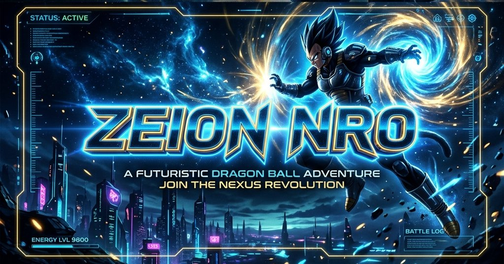
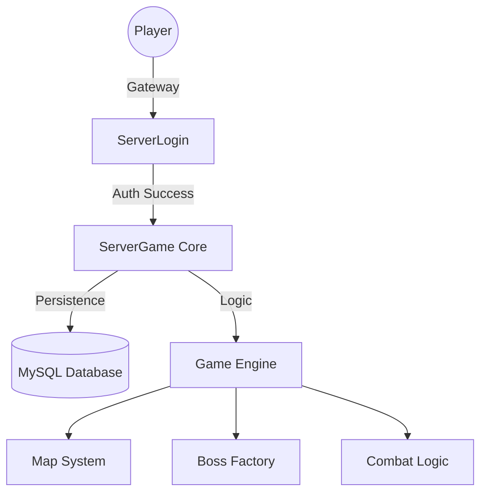

<div align="center">
  

  # Zeion NRO: The Ultimate Dragon Ball Core

  [](https://adoptium.net/)
  [](https://maven.apache.org/)
  [](#)
  [](#)

  **A state-of-the-art, high-performance Ngọc Rồng Online server infrastructure.**
  *Optimized for extreme concurrency, modern security standards, and professional developer experience.*

  ---
</div>

## Vision
**Zeion NRO** is not just another private server source. It is a complete modernization of the legendary NRO backend. By leveraging **Java 21 LTS** and a refined **Thread-Safe Architecture**, we provide a rock-solid foundation for the next generation of Dragon Ball gaming communities.

## Premium Features
- **Modern Runtime**: Powered by **JDK 21**, utilizing the latest JVM optimizations.
- **Vivid Logging Engine**: A custom-built SLF4J implementation providing real-time, color-coded diagnostic data.
- **Concurrency Mastered**: Core managers refactored with `CopyOnWriteArrayList` and atomic references for fail-safe multi-threading.
- **Rapid Deployment**: Orchestrated via a master **Makefile** for one-command environment setup.

## System Architecture


## Monorepo Structure
| Component | Description |
| :--- | :--- |
| **`ServerLogin`** | High-speed authentication gateway & session manager. |
| **`ServerGame`** | The flagship game core handling world logic, entities, and skills. |
| **`SQL`** | Optimized database schemas and migration scripts. |

## Management CLI
Take control of the entire universe from your terminal:

| Command | Action |
| :--- | :--- |
| `make setup` | Initializes configuration files and asset directories. |
| `make build` | Compiles and packages all modules into production JARs. |
| `make clean` | Purges all build artifacts and system logs. |
| `make run` | Launches the full server infrastructure. |

## Getting Started

### Prerequisites
1. **Java 21 LTS** (Required for Lombok/Compiler compatibility).
2. **Maven 3.9+**.
3. **Make** utility.

### Installation
```bash
# 1. Prepare environment
make setup

# 2. Deploy assets
# Download the Data Pack from GitHub Releases and extract to root.

# 3. Build the universe
make build
```

---

<div align="center">
  <sub>Developed with ❤️ by <b>Zeion Team</b>. Professional Grade Game Server Infrastructure.</sub>
</div>
