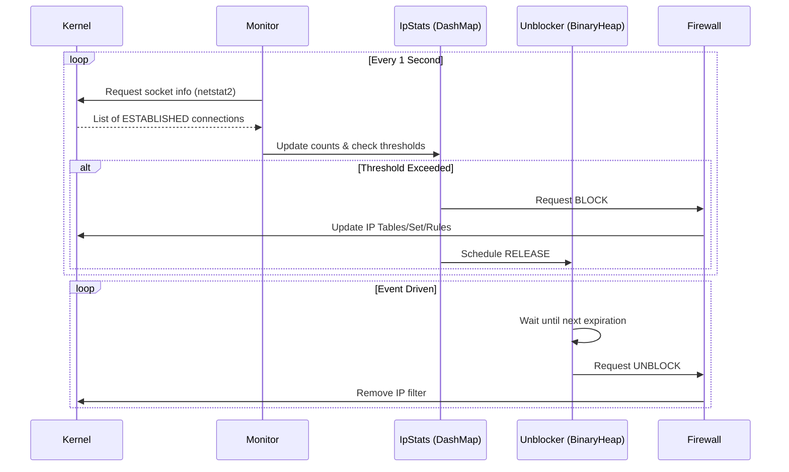

# Zeion Anti-DDoS PRO: Technical Architecture

This document provides a deep-dive into the technical internals of the Rust-based Anti-DDoS engine. It explains how the system achieves high performance, cross-platform compatibility, and reliable protection.

---

## 1. High-Level Workflow

The system operates in a perpetual loop of three main phases: **Monitoring**, **Mitigation**, and **Recovery**.

---

## 2. Core Components

### Connection Tracking (DashMap)
Instead of a global `Mutex<HashMap>`, we use **`DashMap`**.
- **Reasoning**: `DashMap` shards the data internally, allowing multiple threads (Monitor and Unblocker) to read and write connection stats concurrently without being blocked by a global lock.
- **Data Point**: Each entry tracks `connection_count`, `last_seen`, and `is_blocked` status.

### Dynamic Monitoring (netstat2)
The `Monitor` task uses the `netstat2` crate to pull low-level OS socket information.
- **Optimization**: We filter only for `TCP` and `ESTABLISHED` states. This prevents the tool from wasting cycles on half-open connections or irrelevant protocols, making it extremely lightweight.

### Event-Driven Unblocking (BinaryHeap)
The `Unblocker` does NOT use a polling loop (which would waste CPU).
- **Mechanism**: Blocks are stored in a **Min-Priority Queue** (`BinaryHeap`). The system always knows exactly when the *next* IP is due to be unblocked.
- **Efficiency**: It uses `tokio::select!` to sleep until the earliest expiration time. If a new block arrives during sleep, it wakes up, updates the queue, and recalculates the next sleep duration.

---

## 3. Firewall Abstraction Layer

The engine uses a Trait-based abstraction to handle OS-specific commands.

| OS | Backend | Strategy |
| :--- | :--- | :--- |
| **Linux** | `ipset` | Uses hashing for O(1) IP lookup. Extremely fast even with 100,000+ blocked IPs. |
| **macOS** | `pfctl` | Uses recursive anchors (`com.antiddos.pro`) to keep system rules clean and manageable. |
| **Windows**| `netsh` | Manages a singular firewall rule with a comma-separated list of remote IPs for better performance. |

---

## 4. Stability & Reliability

### Self-Healing Initialization
On every startup, the engine performs a **Cleanup Phase**. It flushes its specific anchors, sets, or rules. This ensures that even if the system crashed previously, no "ghost" blocks remain to block legitimate players.

### Graceful Shutdown
By catching `SIGINT` (Ctrl+C) and `SIGTERM`, the application guarantees that it will dismantle its firewall rules before exiting. This leaves the host OS in a clean state, preventing permanent lockouts.

---

## 5. Security Principles

1. **Stateful Filtering**: By only blocking `ESTABLISHED` connections that exceed a threshold, we avoid blocking users during accidental SYN-flood false positives.
2. **Privilege Isolation**: The app checks for Root/Admin privileges at the very first instruction to prevent partial initialization failures.
3. **Log Rotation**: Built-in daily rotation ensures that logs never consume the host's entire disk space, even during heavy attacks.
